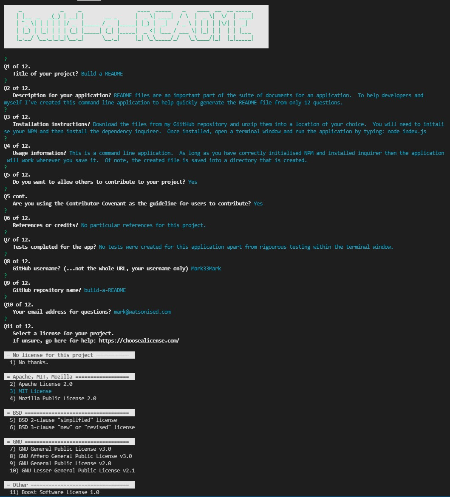

# USYD-FSF Week9 Project
## Node.js: Professional README Generator

### Table of Contents  
  
   1. [Project Description](#1-description)
   2. [Application Features](#2-features)
   3. [Installation](#3-installation)
   4. [Usage](#4-usage)
   5. [Credits](#5-credits)
   6. [License](#6-license)
   7. [Repository Status](#7-github-repo-status)
   8. [Contribute](#8-how-to-contribute)
   9. [Tests](#9-tests)
   10. [Checklist](#10-checklist)

---
### 1. Description  
**What is this project?**  
* It’s important to have a high-quality README file for your application, particulary when creating as an open source project. 
* The README should include what the app is for, how to use the app, how to install it, how to report issues, and how to make contributions.  
* This application is intended to provide the user with a quick and easy way to create a README file by using a command-line application. 

**Why this project?**  
* Including a README file with your applications is key to presenting yourself as a professional and ideally encouraging other developers to contribute to your work to keep your application relevant.

* Following are some screen grabs of the application inside the Powershell terminal:




**What problem does this project solve?**  
* Helps automate the process of creating a professional README file by prompting the user for the content of the key headings that should be included in all README files.

**Lessons learnt?**  
* There were some challenges here as I discovered some glitches with Inquirer on my system.  In particular the Inquirer 'raw list' type continues past the limit of items.  My theory is the issue is caused by the list separators I included.
* Modulising of my code - I started the project doing this then ended up wrapping the generateMarkdown.js script to have modulised scripts in it.  I kind of ran out of time and ended up bundling the code into one long script - far from what I'd planned to do.
* Backtick literals really interferes with good indentation practices.  Had the fun experienc of running Prettier and it destroyed all my formatting in the README file.  To quickly recover I simply moved all the backtick literals to the left margin.  Consequently the indentation is not great.

---
### 2. Features  
Client requested features as implemented:  

- a command-line application that accepts user input about the user's application repository;
- from the user's response a high-quality, professional README.md is generated with the title of my project and sections entitled Description, Table of Contents, Installation, Usage, License, Contributing, Tests, and Questions;
- Entering a project title results in the title displaying as the title of the README;
- Enter a description, installation instructions, usage information, contribution guidelines, and test instructions
results in this information being written to the respective sections of the README entitled Description, Installation, Usage, Contributing, and Tests;
- Choosing a license for the application from a list of options results in a badge for that license being added near the top of the README and a notice is added to the section of the README entitled License that explains which license the application is covered under;
- when the user enters their GitHub username then this is added to the section of the README entitled 'How to Contact Me', with a link to the user's GitHub profile;
- when the user enters their email address it is added to the section of the README entitled 'How to Contact Me', with instructions on how to reach the user with additional questions.
- clicking on the links in the Table of Contents takes the user to the corresponding section of the README

---
### 3. Installation  
You can download the source code from [my Github repository](https://github.com/Mark33Mark/build-a-README), install into a location of your choosing.  Open a terminal window and navigate to the folder with the application in it.  
You will need to install Node.js if you haven't already in your system.  Once node is installed then install the dependancy 'Inquirer' by typing and then initialise the folder with the command npm init -y, as follows: 

```
npm install inquirer
npm init -y
```   
Once inquirer is installed you can run the application by typing:

```
node index.js
```  

---
### 4. Usage  
You need a terminal window to run this application.  The README file is saved into a directory created by the app, if it isn't available, in the local folder / directory.

---
### 5. Credits  
No particular credits for this one. I relied on the inquirer documentation for this project.

---
### 6. License  
 The works in this repository are subject to:  

[](doc/LICENSE.md)

---
### 7. Github repo status  


---
### 8. How to Contribute
 If you would like to contribute, please comply with the Contributor Covenant Code of Conduct:  

[](doc/code_of_conduct.md)

---
### 9. Tests  
- No tests written, wanted to write some using Jest but now an action for the future.
- Tested the application in a couple of terminal applications and the rendering of graphics / colours differs however the function of the application was the same.  Application tested in GitBash, Powershell and embedded Powershell in VS-Code.

---
### 10. Checklist  
 All actions not checked are still to be completed:
* [x]  .gitignore file created to idgnore `node_modules/` and `.DS_Store/` during commits.
* [x]  sample README generated using the application is located: [sample README](your_new_README/README.md).
* [x]  Github repository contains application code [Github location](https://github.com/Mark33Mark/build-a-README)
* [x]  a video is uploaded to my Google Drive showing the typical user flow through the application. This includes views of the prompts and the responses after their selection.  The video can be accessed from: [GoogleDrive Video](https://drive.google.com/file/d/1cAog-PyYmsD4gmm9ViNk0OcmPDlzMPxI/view?usp=sharing) 
* [x]  The application uses the [Inquirer package](https://www.npmjs.com/package/inquirer).
* [x]  Application loads with no errors.
* [x]  Repository has a unique name; follows best practice for file structure; and naming conventions.
* [x]  The application resembles the mock-up functionality provided in the assigment instructions.
* [x]  Repsository follows best practices for class/id naming conventions, indentation, quality comments, etc.
* [x]  Repository contains multiple descriptive commit messages.
* [x]  Repository contains a README file with description, screenshot and link to deployed application.
---

- [Back to the top](#usyd-fsf-week9-project)
