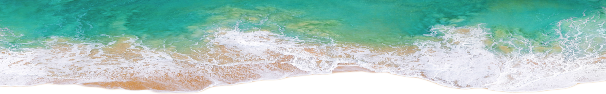

# <PLACEHOLDER> Project Title

  
  

  ### Table of Contents
1. [Project Description](#1-description)
6. [License](#6-license)
  
  ---
  ### 1. Description 

	<PLACEHOLDER> 
	Your motivation? 
	Why build this? 
	What problem does it solve? 
	What did you learn?
  
---
### 3. Installation
The steps required to install project and how to get the development environment running:
* <PLACEHOLDER> Step-by-step description of how to get the development environment running.

---
### 6. License
This project is licensed under the terms of the:  
* MIT License

---

  
  ### Questions?  