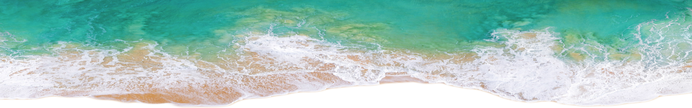

# Build a README

  
  

### Table of Contents
  1. [Project Description](#1-description)
  2. [Installation](#2-installation)
  3. [Usage](#3-usage)
  4. [Credits](#4-credits)
  5. [License](#5-license)
  6. [How to contribute](#6-how-to-contribute)
  7. [Tests](#7-tests)
  8. [Questions](#8-how-to-contact-me)

---
### 1. Description 
It’s important to have a high-quality README file for your application, particulary when creating as an open source project.  This application creates a README for the user following their response to 12 questions.
  
---
### 2. Installation
The steps required to install the project and how to get the development environment running:
* You can download the source code from [my Github repository](https://github.com/Mark33Mark/build-a-README), install into a location of your choosing.  Open a terminal window and navigate to the folder with the application in it. 

---
### 3. Usage 
You need a terminal window to run this application.  The README file is saved into a directory created by the app, if it isn't available, in the local folder / directory.

---
### 4. Credits 
No particular credits for this one. I relied on the inquirer documentation for this project.

---
### 5. License
This project is licensed under the terms of the:  
* MIT License

---
### 6. How to Contribute 
Contributions to this project are welcomed.

Guidelines for contributing are available from: [Contributor Covenant](https://www.contributor-covenant.org/)

Please do not contribute unless you are familiar with the guidelines. 

---
### 7. Tests 
No tests written, wanted to write some using Jest but now an action for the future.  Tested the application in a couple of terminal applications and the rendering of graphics / colours differs however the function of the application was the same.  Application tested in GitBash, Powershell and embedded Powershell in VS-Code.

---
### 8. How to Contact Me 
I hope you enjoy the application.  If you have any questions or would like to connect, please do so by email:

mark@watsonised.com

or follow me at my GitHub:

[Mark33Mark's GitHub](https://github.com/Mark33Mark)

---

- [Back to the top](#build-a-readme)
